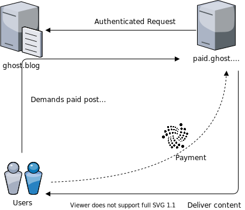

<p align="center">
    
</p>  

# ghost-iota-pay
Pay per content in ghost blog with IOTA.  
Test it here: ([blog.f-node.de](https://blog.f-node.de))  
Watch it here: ([https://www.youtube.com/watch?v=3XG2W9J3b1A](https://www.youtube.com/watch?v=3XG2W9J3b1A))



## Running ghost-iota-pay
### Install requirements
```shell
pip install -r requirements.txt
```
If python does not find the iota client install it from the wheel file
```shell
pip install iota_client_python-0.2.0_alpha.3-cp36-abi3-linux_x86_64.whl
``` 

### Set environment variables
Copy the env file  
```shell
cp example.env .env
```
Alter the following variables:  

- `URL`
  Default Value: `http://localhost:2365` . Set to the url of the ghost blog which shall be fetched.

- `GHOST_ADMIN_KEY`
  Default Value: _null_. Set to the admin key of a custom integration. Can be generated in the admin dashboard ([Custom Integration](https://ghost.org/integrations/custom-integrations/))

- `IOTA_ADDRESS`
  Default Value: _null_. Set to the IOTA Address which is owned by the blog. The application will listen there for incoming payments.

- `NODE_URL`
  Default Value: `https://api.hornet-1.testnet.chrysalis2.com`. Set to the url of your prefered node.  
  :warning: **This is the DEV-Net. If you want to use the mainnet you should use mainnet nodes such as `https://chrysalis-nodes.iota.org`**


### Run the app
```shell
python app.py
```
This will serve the app on port 5000.

## Running ghost-iota-pay in Docker

Build the image
```shell
docker build --tag ghost-iota-pay .
```

Run the image as container
```shell
docker run -p 5000:5000 -v /$(pwd)/db:/app/db ghost-iota-pay
```

This will serve the app on port 5000.

## Usage
When offering payed articles on your ghost blog just add a link on the subscribtion form which points to `https://your-ghost-iota-pay-domain.com/{slug}` where slug is the slug of the requested article.
After the payment the article is fetched through the admin API and served to the user.  

## Integration in ghost
Put the following code into the `post.hbs` of your ghost theme and replace `{{ghost-iota-pay-url}}` with the url of your ghost-iota-pay gateway:  
```handlebars
{{#has visibility="paid"}}
    <button id="ghost-iota-pay-link" 
        style="
            margin-left: 15px;
            background: black;
            border-radius: 5px;">
                <a style="color: white;" 
                    href="{{ghost-iota-pay-url}}{{slug}}">
                        Buy with 
                        
                </a>
   </button>
{{/has}}
```
Example file [ghost-integration/post.hbs](ghost-integration/post.hbs)
